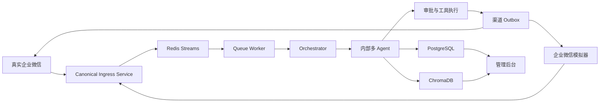

# Memory Palace OS 统一员工助手完整演示旅程与可执行 UAT

> 文档性质：新增产品目标文档，不替代现有 PRD，也不继承旧动画 Demo 的实现约束  
> 产品阶段：企业 MVP 交付验收  
> 核心入口：企业运营助手、企业微信模拟器、管理后台  
> 强制模型：`deepseek-v4-flash`  
> 更新时间：2026-07-29  
> 关联文档：[统一员工助手与经验资产企业 MVP PRD](../../PRD-memory-palace-unified-agent-experience-mvp.md)、[企业 MVP 页面地图](./unified-agent-page-map.md)

## 1. 文档目的

本旅程用于证明 Memory Palace OS 是一套员工能够使用、管理者能够治理、企业能够审计的真实业务系统，而不是管理后台中的功能集合，也不是播放预设步骤的演示页面。

验收必须由用户从员工侧发起自由输入，实际经过身份映射、正式 API、Redis Streams、Queue Worker、Orchestrator、真实 Agent、DeepSeek、PostgreSQL、ChromaDB、审批和审计链路，最终在企业运营助手中再次复用已审核经验。

演示成功的业务闭环为：

```text
员工企微模拟器
  -> 企业运营助手
  -> 现场事件
  -> SOP / 历史经验检索
  -> 处置方案与任务图
  -> 高风险动作审批
  -> 员工执行与结果回填
  -> Watcher 合规检查
  -> 事件闭环
  -> 经验候选生成
  -> 专家访谈萃取
  -> 知识负责人审核发布
  -> 下一次员工提问自动复用
  -> 管理后台全链路审计
```

## 2. 产品边界

### 2.1 三类界面

| 界面 | 面向角色 | 产品职责 |
|---|---|---|
| 企业运营助手 | 普通员工、专家 | 咨询、上报、补充信息、接收任务、完成任务、参加经验访谈 |
| 企业微信模拟器 | 演示人员、实施人员 | 模拟企业微信会话外壳，验证与真实企微相同的入站、出站和身份映射链路 |
| 管理后台 | 经理、知识负责人、管理员 | 事件处置、任务调度、审批、知识治理、经验审核、审计和运维 |

员工只看见一个“悦山企业运营助手”。`ContextTrigger`、`Router`、`Commander`、`MemoryOps`、`TodoWrite`、`PersonaExtract`、`Persona` 和 `Watcher` 都是后台能力，员工不能选择 Agent，也不需要理解 Agent 名称。

### 2.2 模拟器的真实性边界

企业微信模拟器不是动画播放器，也不能读取固定 JSON。它必须：

1. 使用服务端授权的测试员工身份，不接受浏览器任意提交 `user_id` 或 `venue_id`。
2. 经过与真实 `/v1/wechat` 回调相同的 Canonical Ingress Service。
3. 实际写入消息、会话、队列、Agent、事件和审计数据。
4. 将系统出站消息写入可查询的渠道 outbox，再由模拟器拉取并展示。
5. 明确显示“企微模拟环境”，出站状态使用“已送达模拟器”，不得伪装成“真实企微已送达”。
6. 真实企微 `READY` 仍需另行提供客户沙箱的 URL 验签、加密回调和真实回复证据。

### 2.3 禁止项

以下任一情况出现，本旅程直接判定失败：

- 使用旧 Demo Controller、YAML 场景步骤、定时动画或硬编码数组推进业务状态。
- 预先向数据库写入本旅程的事件、任务、审批、访谈答案或发布结果。
- 用 Swagger、数据库手工修改或临时脚本替代用户界面中的业务操作。
- 生成式步骤未调用 `deepseek-v4-flash`，或者 `llm_call_logs.is_mock = true`。
- 页面显示假发送、假审批、假检索或 `[null]` 引用。
- 员工需要进入“数字分身”管理页或直接选择某个 Persona 才能提问。
- 业务页面默认暴露 UUID、`venue_id`、`session_id`、原始 JSON 或英文内部状态。

## 3. 产品链路



建议接口名为目标契约；实现可以采用等价路径，但链路和证据合同不能改变：

- 员工 Web 备用入口：`/assistant/`
- 企微模拟器：`/simulator/wecom/`
- 模拟消息入站：`POST /api/v1/channels/wecom-simulator/messages`
- 现有正式消息入口：`POST /api/v1/messages/`
- 真实企微回调：`GET/POST /v1/wechat`
- 消息状态：`GET /api/v1/messages/{message_id}`
- 会话消息：`GET /api/v1/assistant/conversations/{conversation_id}/messages`
- 事件、任务、审批、知识和审计：沿用 `/api/v1/admin/*`

模拟器 Adapter 和真实企微 Adapter 都必须调用同一个服务层，不得分别实现两套 Agent 业务流程。

## 4. 连贯业务故事

### 4.1 场景

2026 年 8 月 8 日 17:40，悦山景区夜游开园前，东门运营员李明在 12 号观光车空载试车时听见右后轮间歇性金属摩擦声。前一晚有强降雨，车辆尚未载客。李明已经停车断电，但不知道能否继续使用，也不知道应该检查什么。

事件完成后，资深设备主管张建国补充了“雨后轮端异响”的隐性判断经验。知识负责人赵敏审核发布后，第二天另一名员工周琪遇到相似但不完全相同的问题，统一助手自动复用该经验和已发布 SOP。

### 4.2 演示角色

| 姓名 | 业务身份 | 系统角色 | 主要入口 |
|---|---|---|---|
| 李明 | 东门运营员、首次上报人 | `operator` | 企微模拟器 |
| 陈雨 | 设备检修员 | `operator` | 企微模拟器、员工任务页 |
| 王芳 | 当日值班经理 | `manager` | 管理后台、企微模拟器 |
| 张建国 | 资深设备主管、经验来源专家 | `operator` + 专家授权 | 企微模拟器 |
| 赵敏 | 组织知识负责人 | `manager` 或独立知识角色 | 管理后台 |
| 周琪 | 次日早班运营员 | `operator` | 企微模拟器 |
| 刘海 | 系统管理员、最终审计人 | `admin` | 管理后台 |

所有页面默认展示姓名、岗位、部门、场地和人类可读业务编号。技术 ID 只出现在折叠的“技术详情”中。

## 5. UAT 起始条件

### 5.1 基础设施

- App、PostgreSQL、Redis、ChromaDB 和 Nginx 均为健康状态。
- Queue Worker 已加入 Redis Consumer Group，`pending = 0`、`lag = 0`。
- DeepSeek 使用部署 Secret 注入，模型为 `deepseek-v4-flash`，健康探针已产生一条真实成功调用。
- 禁用旧 Demo 路由；本旅程不能通过 `DEMO_MODE` 获得业务结果。
- 企微模拟器仅在 UAT 环境或授权角色中启用，并有醒目的模拟环境标识。

### 5.2 主数据

主数据可以通过正式管理界面或正式 API 预置，但业务过程数据不能预置：

- 企业：悦山文旅集团。
- 场地：悦山景区。
- 上述七名用户及角色已建立。
- 企微模拟身份已与用户、企业和场地建立服务端绑定。
- 已发布 SOP：`观光车雨后复运与异常异响处置`，版本 `2.1`。
- 高风险规则：停运载客车辆、启用备用车辆、向调度群发送严重告警需要值班经理审批。
- 张建国已签署经验使用授权，但系统中尚不存在“雨后轮端防尘护板异响”经验卡片。

### 5.3 业务基线

执行前通过正式搜索确认：

- 不存在本次事件。
- 不存在与本次输入文本相同的消息。
- 不存在本次任务和审批。
- 已发布知识中只有通用雨后复运 SOP，没有本次根因的精确经验。

基线快照进入证据包。测试完成后不能通过删除失败记录来制造干净结果。

## 6. 编号与关联规则

系统必须服务端生成并展示人类可读编号，例如：

- 事件：`SJ-20260808-0001`
- 任务：`RW-20260808-0001`
- 审批：`SP-20260808-0001`
- 经验：`JY-20260808-0001`
- 访谈：`FT-20260808-0001`

每次 API 请求仍保留独立 `trace_id`。跨多轮会话和多个请求的业务实体通过 `journey_id`、`event_id` 或等价关联键聚合。管理后台必须能从事件编号进入所有子 Trace，不能要求审计人手工复制多个 UUID 拼接链路。

## 7. 完整演示旅程

### E2E-00 管理员确认运行配置和渠道真实性

**角色：** 刘海。  
**界面：** `/admin/channels`、`/admin/diagnostics`。  
**输入：** 使用管理员账号登录，打开企微渠道和运行诊断，执行一次只读健康检查。  
**动作：** 检查 App、PostgreSQL、Redis、ChromaDB、Queue Worker、8 个 Agent 和 DeepSeek；确认企微模拟器与真实企微使用不同的就绪状态。  
**可见结果：** 页面以人类可读名称显示各依赖健康状态；模型显示 `deepseek-v4-flash` 且最近真实调用成功；模拟器显示 `SIMULATOR_READY`。若当前没有客户企微凭据，真实企微必须显示“未配置，不能收发消息（`DISABLED_REQUIRES_CONFIG`）”，并提供配置缺项，不能显示 `READY`。  
**持久化证据：** 脱敏后的配置快照、健康检查记录、Agent 注册快照、最近 DeepSeek 调用记录、渠道就绪判定和管理员查看审计；任何证据均不得包含 API Key、企微 Secret 或鉴权头。  
**失败路径：** 任一必需依赖不健康、DeepSeek 最近真实调用失败或模拟器身份主数据不完整时，主旅程不得开始；页面必须给出影响范围和修复入口。  
**验收断言：** 演示人员能在一个页面准确说明“哪些能力已就绪、哪些真实外部集成仍未配置”；模拟器就绪不会把真实企微状态改成 `READY`。

### E2E-01 打开企微助手并确认身份

**角色：** 李明。  
**界面：** `/simulator/wecom/`，企微会话列表与“悦山企业运营助手”聊天窗口。  
**输入：** 由授权演示人员选择“李明 / 东门运营员 / 悦山景区”；生产员工不需要选择身份。  
**动作：** 打开助手会话。  
**可见结果：** 顶部显示李明的姓名、岗位和所属景区；历史会话从服务端加载；页面显示“企微模拟环境”，不显示 Agent 选择器。  
**持久化证据：** `users`、渠道身份映射表或等价关系、`sessions`、登录与身份解析 `audit_logs`。  
**失败路径：** 未绑定、已停用或跨场地的企微身份被拒绝，页面提示联系管理员绑定，不回退为匿名用户。  
**验收断言：** 浏览器不能通过修改请求体中的 `user_id` 或 `venue_id` 冒充其他员工；李明只能看到自己的员工会话和任务。

### E2E-02 发送自由文本和现场附件

**角色：** 李明。  
**界面：** 企微模拟器聊天输入区。  
**输入：**

```text
12号观光车刚做开园前试车，右后轮间歇性金属摩擦声，昨晚下过大雨，车上没人。我已经把车停在维修区并断电了，下一步怎么处理？
```

附件为真实上传的现场图片，附件说明为“右后轮内侧有水迹，车辆已断电，现场无人受伤”。  
**动作：** 点击发送一次。  
**可见结果：** 消息立即出现在会话中，状态依次为“发送中”“已受理”“处理中”；附件缩略图、说明、上传人和时间均可查看。  
**持久化证据：** 渠道入站消息记录、附件元数据与对象引用、`message_runs` 的 `QUEUED` 状态、Redis Stream entry ID、`MESSAGE_RUN_CREATED` 与 `MESSAGE_ENQUEUED` 审计。  
**失败路径：** 图片类型、大小或病毒扫描不合格时，附件被拒绝并给出中文原因；文本不因附件失败而静默丢失。重复发送同一 `client_message_id` 时只受理一次。  
**验收断言：** 数据库只存在一条业务入站消息和一条处理 run；刷新浏览器后原消息和附件说明仍然存在。

### E2E-03 完成智能受理并返回事件、SOP 和处置建议

**角色：** 系统后台处理，李明观察结果。  
**界面：** 企微模拟器消息状态与统一助手回复卡片；管理后台技术详情可查看处理阶段。  
**输入：** E2E-02 的原始自由文本、附件说明、已认证员工和场地上下文。  
**动作：** Queue Worker 消费消息，Orchestrator 调用 ContextTrigger、Router、MemoryOps 和 Commander；MemoryOps 检索 ChromaDB 与 PostgreSQL，Commander 生成受引用约束的结构化处置建议。  
**可见结果：** 员工侧先显示“正在分析现场风险”，随后返回人类可读事件卡片，且不暴露内部 Agent 名称。卡片至少包含：

- 事件编号。
- “P1 / 重大设备安全风险”及判断理由。
- 立即保持停运、隔离车辆、保管钥匙、禁止载客等安全动作。
- 已发布 SOP `观光车雨后复运与异常异响处置 v2.1` 的引用。
- “尚未找到与本次根因完全一致的历史经验”的诚实说明。
- 下一步需要补充的检查项。

**持久化证据：** `message_runs` 从 `QUEUED -> PROCESSING -> COMPLETED` 的时间、Redis Stream entry ID、`sessions`、`conversation_turns`、`confirmed_events`、事件与原消息关联、知识检索快照、SOP 版本引用、Chroma 查询结果、Agent 阶段审计，以及四个 Agent 的 `llm_call_logs`。每条模型记录满足 `provider = deepseek`、`model_name = deepseek-v4-flash`、`is_mock = false`。  
**失败路径：** Redis 暂时不可用时返回可重试错误，消息不得显示完成；DeepSeek 超时或 401 时进入重试或人工处理状态，不生成固定兜底判断；没有知识命中时显示“未找到已发布依据”，不得返回 `reference_cases: [null]`；ChromaDB 不可用时不能伪造引用。  
**验收断言：** 成功路径中四个 Agent 均有真实模型证据；页面引用可点击进入对应已发布 SOP，引用 ID、标题、版本、状态和来源均非空；同一消息在 Worker 重试时只创建一个事件。

### E2E-04 在同一会话补充现场信息

**角色：** 李明。  
**界面：** 同一企微助手会话。  
**输入：**

```text
补充：异响随车轮速度变化，踩刹车时声音没有明显变大；右后轮温度正常，没有焦味，车辆现在停在东门维修区。
```

**动作：** 发送补充信息，并在事件卡片中确认位置。  
**可见结果：** 助手确认信息已追加到同一事件，不创建新事件；事件详情显示报告人“李明”、地点“东门维修区”和结构化观察项。  
**持久化证据：** 新的渠道消息、同一 `session_id`、`conversation_turns`、事件补充字段或事件动态表、父子 Trace 关联、`EVENT_UPDATED` 审计。  
**失败路径：** 其他场地或无权限用户携带该 `session_id`、`event_id` 补充信息时返回 404 或 403，并记录拒绝审计。  
**验收断言：** 事件数量仍为一条；会话历史包含两轮员工消息和两轮助手结果，刷新后完整恢复。

### E2E-05 使用 TodoWrite 生成可执行任务图

**角色：** 王芳查看，系统生成。  
**界面：** 管理后台事件详情中的“处置任务”区域；李明企微侧收到摘要。  
**输入：** 已确认事件、SOP 检查项和处置目标。  
**动作：** TodoWrite 将目标拆成有依赖关系的任务，并由经理确认负责人。  
**可见结果：** 至少生成以下四项人类可读任务：

1. 李明：隔离 12 号车并上传钥匙封存与警戒照片。
2. 陈雨：检查右后轮防尘护板、制动片、制动盘和涉水痕迹，记录测量值。
3. 陈雨：完成空载低速三轮试车并记录温度、异响和制动表现。
4. 王芳：决定是否继续停运 12 号车、启用 7 号备用车并通知调度。

任务 2 依赖任务 1，任务 3 依赖任务 2，任务 4 依赖任务 3。  
**持久化证据：** `task_decompositions`、`tasks`、依赖数组、负责人、事件关联、TodoWrite 的 `llm_call_logs`、`TASK_CREATED` 与 `TASK_DECOMPOSED` 审计。  
**失败路径：** 刷新、双击或网络重试必须使用同一幂等键返回原任务图；不得重复创建四项任务。DeepSeek 返回不合格结构时整次拆解失败并可重试，不能留下半套可见任务。  
**验收断言：** 后台和员工侧任务数量、依赖、负责人一致；不存在 `STAGED` 残留；每项任务都有业务编号而不是只显示 UUID。

### E2E-06 验证任务依赖、员工权限并回填检修证据

**角色：** 陈雨、李明。  
**界面：** 员工任务页或企微任务卡片及结果表单。  
**输入：** 陈雨先尝试开始任务 2；随后李明完成任务 1。陈雨开始任务 2 后填写：

- 防尘护板固定螺栓：右后侧松动。
- 护板与制动盘最小间隙：`0.4 mm`。
- 制动片厚度：`8.1 mm`。
- 轮端温度：`31.6 C`。
- 焦味：无。
- 现场结论：雨后轻微变形的护板与制动盘间歇摩擦。
- 检修前后照片各一张。

**动作：** 先执行一次被依赖阻止的开始操作；李明上传照片并完成车辆隔离后，陈雨按正确顺序开始任务 2 并提交结构化结果。  
**可见结果：** 陈雨第一次看到“等待李明完成车辆隔离”；任务 1 完成后任务 2 自动解锁。检修结果以字段、单位、照片和提交人展示，任务 3 随后解锁。  
**持久化证据：** `tasks` 状态与结构化结果、附件引用、依赖解除时间、提交人和时间、`TASK_START_DENIED`、`TASK_STARTED`、`TASK_COMPLETED` 审计。  
**失败路径：** 未分配员工不能操作任务；依赖未完成时服务端返回 409；只填写“已处理”“正常”或缺少关键测量项时返回中文校验错误，任务保持执行中。  
**验收断言：** 被拒绝操作不改变任务状态；任务 1 只解除其直接依赖；结果不以原始 JSON 展示，刷新后仍可读并能从事件追溯。

### E2E-07 创建高风险动作审批

**角色：** 系统请求，王芳审批。  
**界面：** 管理后台审批中心；王芳企微侧收到审批提醒。  
**输入：** “12 号车今晚继续停运，启用 7 号备用车，向夜游调度群发布车辆替换告警”。  
**动作：** Permission Engine 根据风险策略创建审批，不直接执行通知。  
**可见结果：** 审批卡显示业务编号、关联事件、请求原因、影响范围、请求人、证据摘要和待审批状态。  
**持久化证据：** `approval_requests` 为 `PENDING`、`correlation_trace_id`、事件和任务关联、`CONTROLLED_ACTION_REQUESTED` 审计；此时 `tool_invocation_logs` 中没有已执行记录。  
**失败路径：** 普通员工不能批准自己的请求；未关联事件、会话或证据的请求被拒绝创建；外部渠道未配置时审批卡明确显示对应渠道不可用。  
**验收断言：** 审批前调度群没有收到通知，`execution_status = NOT_STARTED`。

### E2E-08 拒绝审批、补充试车证据并重新提交

**角色：** 王芳、陈雨、系统。  
**界面：** 管理后台审批详情、企微任务卡片和审批中心。  
**输入：** 王芳拒绝意见：“缺少校正后的空载三轮试车记录，请完成后重新提交。”陈雨随后输入：“已更换防松螺栓并校正护板；空载低速试车 3 轮，无异响，制动无跑偏，结束温度 33.2 C；建议 12 号车今晚继续停运观察。”  
**动作：** 王芳先执行一次真实拒绝；陈雨完成任务 3；系统以新幂等键创建第二张审批并关联被拒绝审批。  
**可见结果：** 原审批变为“已拒绝”，陈雨收到可执行的补充要求；补充后新审批标记“重新提交”，可对比新增证据和上次拒绝原因。  
**持久化证据：** 原 `approval_requests` 为 `REJECTED`，新请求为 `PENDING`；保留审核人、时间、拒绝意见、任务 3 结果、`supersedes_approval_id` 或等价关联、审计和新 Trace；无假工具执行记录。  
**失败路径：** 并发审批只有第一个终态成功；系统不能篡改原已拒绝审批；重复点击重新提交只创建一张新审批。  
**验收断言：** 历史同时保留一张 `REJECTED` 和一张 `PENDING`，证据版本可追溯；调度通知仍未发出。

### E2E-09 批准动作并送达到企微模拟器

**角色：** 王芳。  
**界面：** 管理后台审批详情、相关员工企微会话。  
**输入：** 批准意见：“同意 12 号车停运观察，启用 7 号备用车，按调整后计划发车。”  
**动作：** 批准第二张审批；工具执行器写入渠道 outbox；模拟器消费出站消息。  
**可见结果：** 审批显示“已批准 / 已执行”；李明、陈雨和调度角色的企微模拟器实际收到通知卡，内容包含事件编号、车辆调整和负责人。  
**持久化证据：** `approval_requests` 的 `APPROVED` 与执行结果、`tool_invocation_logs`、`push_logs` 或渠道 outbox、每个收件人的送达状态、`APPROVAL_APPROVED` 和 `CONTROLLED_ACTION_EXECUTED` 审计。  
**失败路径：** 工具或渠道执行失败时审批保持“已批准”，执行状态单独为“失败 / 可重试”，不得显示已送达；重试复用同一业务幂等键，不重复发送。  
**验收断言：** 模拟器状态明确为“已送达企微模拟器”，不能写成“真实企微已送达”；每个收件人只有一条出站通知。

### E2E-10 完成任务并验证闭环门禁

**角色：** 王芳。  
**界面：** 管理后台事件详情与任务图。  
**输入：** 先在任务 4 尚未完成时尝试关闭事件；随后确认备用车已交接并完成任务 4。  
**动作：** 执行一次被阻止的关闭，再完成最终任务。  
**可见结果：** 第一次关闭提示“仍有未完成任务：启用备用车并通知调度”；任务 4 完成后事件显示“具备闭环条件”。  
**持久化证据：** `EVENT_CLOSE_DENIED` 审计、任务 4 的负责人和结果、全部任务终态、事件闭环条件计算结果。  
**失败路径：** 前端隐藏未完成任务或直接提交 `CLOSED` 状态均不能绕过服务端门禁。  
**验收断言：** 被拒绝关闭后事件仍为 `OPEN`；只有全部必需任务、审批和执行结果满足策略后才能进入下一步。

### E2E-11 运行 Watcher 合规检查

**角色：** 王芳。  
**界面：** 事件详情中的“闭环前合规检查”或鹰眼巡检页。  
**输入：** 本事件的消息、SOP 引用、任务结果、审批历史、通知送达和处置耗时。  
**动作：** 手动触发事件级 Watcher 检查。  
**可见结果：** Watcher 返回“证据完整，可闭环”以及检查过的项目；若遗漏关键证据，则生成与具体事件和任务关联的发现。  
**持久化证据：** `watcher_runs`、`watcher_findings`、检查目标快照、Watcher 的 `llm_call_logs`、Trace 和审计。  
**失败路径：** 对同一策略、同一来源、同一问题重复运行时，只更新或复用未关闭发现，不得每次新增同标题发现；模型失败时本次 run 为失败，不能返回默认 100 分。  
**验收断言：** 成功路径有一条真实 `deepseek-v4-flash` Watcher 调用；本故事证据完整时 finding 数为 0，重复运行后仍为 0。

### E2E-12 关闭事件并生成待审核经验候选

**角色：** 王芳。  
**界面：** 管理后台事件详情。  
**输入：**

```text
右后轮防尘护板固定螺栓松动，雨后护板轻微变形并与制动盘间歇摩擦。已更换防松螺栓、校正护板并完成空载低速三轮试车，无异响、无跑偏、温度正常。12号车今晚继续停运观察，7号备用车已投入运行。
```

**动作：** 提交闭环结果。  
**可见结果：** 事件变为“已闭环”；卷宗显示完整时间线、任务、审批、SOP、附件和处置结果；系统提示“发现可沉淀经验，已生成待审核候选”，但不自动发布。  
**持久化证据：** `confirmed_events.status = CLOSED`、`resolution`、`closed_at`、记忆内容和向量引用、经验候选草稿、来源事件关联、`EVENT_CLOSED` 与候选创建审计。  
**失败路径：** 闭环总结为空、过短或与任务证据冲突时拒绝关闭；候选生成失败不回滚已完成的事件闭环，但必须显示“经验候选生成失败 / 可重试”。  
**验收断言：** 已闭环事件不可继续修改；经验候选状态只能是 `DRAFT`，此时无法被员工检索到。

### E2E-13 专家通过统一助手完成经验访谈

**角色：** 张建国。  
**界面：** 企微模拟器中的“悦山企业运营助手”，不是管理后台 Persona 聊天弹窗。  
**输入：** 张建国接受访谈邀请，并依次回答以下主题：

1. 什么现场信号能区分防尘护板摩擦、制动片问题和轴承问题。
2. 雨后检查的正确动作顺序，以及为什么不能直接载客试车。
3. 哪些红线出现时必须停止试车并拖车检修。
4. 该经验适用于哪些车辆、岗位和场地，哪些情况不适用。

关键答案至少包含：异响是否随轮速变化、是否随制动变化、温度和焦味、护板间隙、空载试车，以及“发热、焦味、制动跑偏时禁止继续试车”的例外边界。  
**动作：** PersonaExtract 使用真实 DeepSeek 多轮提问、总结和结构化萃取；员工可中途退出并恢复。张建国逐条检查经验卡并确认提交。  
**可见结果：** 每轮问题和答案在会话中完整可读；最终生成一张人类可读经验卡草稿，字段包括适用情境、判断信号、建议动作、原因、禁忌、例外、来源专家、来源事件、授权范围和版本。专家确认后状态显示“专家已确认”。  
**持久化证据：** 专家授权、`persona_interviews` 或新访谈表、逐轮 `conversation_turns`、原始答案、结构化条目、PersonaExtract 的 `llm_call_logs`、来源与版本审计，以及 `DRAFT -> EXPERT_CONFIRMED` 状态记录。  
**失败路径：** 回答轮次不足时不能结束访谈；刷新或 App 重启后从最后一个未回答问题恢复；重复提交同一轮答案不能生成重复条目。  
**验收断言：** 草稿中不存在只对开发人员有意义的 `trigger/behavior/reason` 原始 JSON 页面；所有生成字段都能回溯到具体访谈轮次和事件证据；状态为 `EXPERT_CONFIRMED` 且仍不能被普通员工检索。

### E2E-14 审核、退回、修订并发布经验

**角色：** 赵敏、张建国。  
**界面：** 管理后台“经验资产 / 待审核”；张建国通过企微助手补充说明。  
**输入：** 赵敏将专家已确认版本提交审核，第一次退回意见为：“‘看情况继续试车’边界不清，请明确禁止试车条件和适用车型。”张建国补充、重新确认后再次提交。  
**动作：** 完整执行 `EXPERT_CONFIRMED -> IN_REVIEW -> DRAFT -> EXPERT_CONFIRMED -> IN_REVIEW -> PUBLISHED`；退回不删除旧版本，发布生成不可变新版本。  
**可见结果：** 管理后台显示版本对比、来源事件、访谈原文、模型摘要和人工修改；发布后形成：

- 编号：系统生成的 `JY-*` 业务编号。
- 标题：`雨后观光车轮端间歇性金属异响判断`。
- 状态：已发布。
- 版本：`1.0`。
- 来源：张建国、对应访谈和事件编号。
- 引用范围：悦山景区设备运营岗位。

**持久化证据：** 经验卡主记录、不可变版本记录、完整状态变化、审核意见、发布人、发布时间、来源与授权、`knowledge_documents` 或等价发布索引、Chroma `vector_doc_id`、`EXPERIENCE_REJECTED`、`EXPERIENCE_REVISED`、`EXPERIENCE_PUBLISHED` 审计。  
**失败路径：** 专家不能审核自己提交的经验；缺少来源、授权、禁忌或例外时禁止发布；Chroma 写入失败时发布事务回滚或进入明确的“索引失败”状态，不能显示可检索。  
**验收断言：** 退回版本从未进入员工检索；发布后 PostgreSQL 状态为 `PUBLISHED`，版本和 Chroma 索引一致，只存在一个当前有效版本。

### E2E-15 再次复用经验并完成后台全链路审计

**角色：** 周琪、刘海。  
**界面：** 次日早班企微模拟器统一助手会话；管理后台“审计与 Trace”。  
**输入：**

```text
7号车晨检时也有轻微金属擦声，声音随车速变化，但踩刹车时没变大，昨天也淋过雨。现在没有发热和焦味，能直接载客吗？
```

**动作：** 统一助手自动调用 Router、MemoryOps，并在后台按需调用 Persona 能力综合已发布经验；员工不选择张建国分身。回答完成后，刘海使用原事件业务编号打开完整业务链路。  
**可见结果：** 助手明确回答“不能直接载客”，给出停运、隔离、检查护板间隙和红线条件；同时引用：

1. `观光车雨后复运与异常异响处置 v2.1`。
2. `雨后观光车轮端间歇性金属异响判断 v1.0`，来源标注为“张建国审核经验 / 来源事件 SJ-*”。

回答说明经验仅供辅助判断，不假装由张建国本人实时回复。后台单一业务时间线至少展示：

- 李明身份映射和原始上报。
- 消息入队、领取、完成和回复送达。
- 8 个 Agent 的输入摘要、结构化输出、状态和耗时。
- 所有 DeepSeek 调用的模型名、状态、Token、耗时和 request ID。
- 事件、附件、SOP 引用和检索证据。
- 四项任务的依赖、负责人和结果。
- 首次审批拒绝、第二次批准和通知送达。
- Watcher 结果、事件闭环和经验候选。
- 专家访谈、审核退回、版本发布和 Chroma 索引。
- 周琪第二次提问对已发布经验的真实引用。

默认页面不展示 API Key、完整 Prompt、密码、Cookie、Token 或附件私有存储地址。  
**持久化证据：** 新 `message_runs`、会话轮次、Router、MemoryOps 和 Persona 的 `llm_call_logs`、Chroma 命中、引用快照、经验使用日志，以及 `audit_logs`、`confirmed_events`、`tasks`、`approval_requests`、`tool_invocation_logs`、`push_logs`、`watcher_runs`、经验版本和所有关联 Trace。  
**失败路径：** 问题超出经验范围时必须降低置信度或不引用；已撤回、未发布或跨场地经验不能命中。其他场地管理员查询该事件或 Trace 时返回 404；敏感字段在 API 和导出中脱敏；读取 Trace 不得改变证据。  
**验收断言：** 两条引用均包含非空 ID、标题、版本、来源和相关性，并真实使用 E2E-14 发布的向量记录；审计人无需查询数据库或拼接 UUID 即可解释整条业务链，页面计数与只读数据库一致。

### E2E-16 真实重启 App 并恢复处理中会话

**角色：** 周琪、刘海。  
**界面：** 周琪的 `/simulator/wecom/` 会话、刘海的 `/admin/diagnostics`。  
**输入：** 周琪在 E2E-15 的同一会话发送“请把护板间隙检查整理成我的今日待办”；当消息状态进入“处理中”后，刘海通过正式运维入口只重启 App 容器，不重启或清空 PostgreSQL、Redis 和 ChromaDB。  
**动作：** App 退出并重新启动；Queue Worker 从 Redis Consumer Group 恢复 pending 消息，前端重新连接并继续轮询原 `message_id`。  
**可见结果：** 周琪先看到“服务正在恢复，任务仍在处理中”，随后在原会话收到一条最终结果；刷新和重新登录后，E2E-01 至 E2E-15 的会话、事件、任务、审批、访谈、经验和引用仍可查看。诊断页显示本次重启时间和恢复结果。  
**持久化证据：** 容器重启时间、App 启动记录、Redis pending/claim/ACK、原 `message_run` 的状态变化、幂等键、会话消息、任务或待办结果、恢复审计和关联 Trace。  
**失败路径：** 超过恢复时限的消息进入明确的“需要人工重试”或死信状态；用户可以从原消息重试，系统不得静默丢失、重复生成待办或伪造成功。  
**验收断言：** App 实际进程或容器 ID 已变化；同一输入只有一个业务结果；全部已提交业务数据在重启前后数量与关联一致，且无需重新注入本次业务状态。

## 8. Agent 覆盖矩阵

| Agent | 旅程步骤 | 必须产生的真实证据 |
|---|---|---|
| ContextTrigger | E2E-03 | 触发判断、结构化输出、DeepSeek 调用、Trace |
| Router | E2E-03、E2E-15 | 意图、目标能力、严重度、DeepSeek 调用 |
| MemoryOps | E2E-03、E2E-15 | Chroma 查询、命中文档、引用快照、DeepSeek 调用 |
| Commander | E2E-03 | 结构化处置建议、引用约束、DeepSeek 调用 |
| TodoWrite | E2E-05 | 任务图、依赖、幂等键、DeepSeek 调用 |
| Watcher | E2E-11 | run、目标快照、finding 或零发现、DeepSeek 调用 |
| PersonaExtract | E2E-13、E2E-14 | 多轮访谈、经验结构、来源映射、DeepSeek 调用 |
| Persona | E2E-15 | 仅由统一助手内部调用、已发布条目、引用和 DeepSeek 调用 |

验收时 8 个 Agent 均必须有输入摘要、结构化输出、运行状态、`trace_id` 和一条 `is_mock = false` 的 `deepseek-v4-flash` 调用。权限、状态机、SQL、幂等和审计本身不得交给模型决定。

## 9. 必须执行的失败与恢复用例

完整演示不能只展示全绿路径，以下分支必须在独立 UAT run 中执行并保留证据：

| ID | 失败或恢复场景 | 预期结果 |
|---|---|---|
| UAT-F01 | 相同企微 `MsgId` 或客户端幂等键重复投递 | 只产生一条消息 run、一个事件和一组任务；重复请求返回原结果 |
| UAT-F02 | Worker 消费后、ACK 前重启 | Redis pending 被回收；任务继续或安全重试；不重复创建事件、任务和通知 |
| UAT-F03 | DeepSeek 超时、401 或熔断 | 用户看到可理解失败和 Trace；无假 Agent 结果；恢复配置后可从原业务动作重试 |
| UAT-F04 | ChromaDB 检索不可用 | 助手明确说明知识依据不可用；不返回空引用或伪造案例 |
| UAT-F05 | 未完成依赖任务时开始后续任务 | 服务端 409；任务状态和审计正确，前端不能越过依赖 |
| UAT-F06 | 审批拒绝、并发审批、工具执行失败 | 审批终态原子化；拒绝不执行；批准与执行状态分离；幂等重试不重复通知 |
| UAT-F07 | 访谈中途刷新或 App 重启 | 从最后未完成问题恢复；已回答轮次不丢失、不重复萃取 |
| UAT-F08 | 发布经验时向量索引失败 | 数据状态与索引一致；不能出现“已发布但检索不到”的假成功 |
| UAT-F09 | 同一 Watcher 策略重复运行 | 相同来源和问题不重复生成未关闭 finding；运行记录仍分别保留 |
| UAT-F10 | 跨场地读取会话、事件、任务、经验和 Trace | 统一拒绝并记录审计；不得通过业务编号推断其他租户数据 |
| UAT-F11 | 普通员工直接调用审批、发布经验或技术 Trace 接口 | 服务端返回 403 并记录拒绝审计；隐藏菜单不能代替鉴权 |
| UAT-F12 | 真实企微凭据未配置却尝试启用或发送 | 渠道保持 `DISABLED_REQUIRES_CONFIG`；页面列出缺项，不入队、不产生假发送或假成功 |
| UAT-F13 | 真实企微外部身份未映射、已停用或无法确定租户 | 入站在业务入队前被拒绝并审计；不创建匿名会话、事件或空租户数据 |

失败测试可以通过受控的 UAT 故障注入执行，但不得使用 Mock Agent 或固定模型输出代替 DeepSeek。故障恢复后必须重新执行一次真实成功调用。

## 10. 可读性验收

所有业务页面必须满足：

- 用户姓名、岗位、部门和场地替代内部用户编码。
- 事件、任务、审批、经验和访谈使用业务编号和中文状态。
- 原始 JSON 只在受权限控制的技术详情中出现，并提供结构化视图。
- 引用显示标题、版本、来源、发布时间、适用范围和相关性。
- 会话列表显示人类可理解标题、参与者、最近消息、业务状态和更新时间。
- 任务结果显示字段名、单位、附件、负责人和完成时间。
- 技术错误同时提供中文说明、`trace_id`、是否可重试和建议动作。
- 页面不出现 `[null]`、`undefined`、空白引用、英文内部枚举或无解释 UUID。

## 11. 证据包规范

每次执行生成唯一 `uat_run_id`，证据包至少包含：

```text
docs/verification/unified-agent-uat/<uat_run_id>/
  manifest.json
  execution-report.md
  screenshots/
  api/
  traces/
  db-assertions.json
  llm-calls.json
  chroma-retrieval.json
  queue-recovery.json
  browser-console.json
```

证据要求：

1. `manifest.json` 记录版本、镜像摘要、Compose 配置摘要、测试账号角色和起止时间，不记录 Secret。
2. 每一步保存输入、预期、实际、业务编号、`trace_id`、截图和断言结果。
3. API 响应来自正式接口；只读数据库断言只能用于核对，不能用于推进状态。
4. `llm-calls.json` 必须证明所有生成式步骤使用 `deepseek-v4-flash` 且非 Mock。
5. Chroma 证据保存查询文本哈希、命中文档 ID、版本、距离或相关性和 PostgreSQL 关联。
6. 失败记录必须保留，不能在出报告前删除。
7. 截图需覆盖 1440x900 桌面管理后台、企微模拟器桌面视图和 375x812 员工移动视图。

## 12. 最终通过门禁

只有同时满足以下条件，才能声明“统一员工助手完整旅程可演示并达到企业 MVP 验收标准”：

1. E2E-00 至 E2E-16 全部通过。
2. UAT-F01 至 UAT-F13 全部通过。
3. 业务记录全部由用户操作和正式服务产生，无业务动画或固定结果。
4. 8 个 Agent 均有真实 DeepSeek、结构化输出和 Trace 证据。
5. 首次事件从上报到闭环完整可追溯。
6. 专家经验经过访谈、人工审核和版本发布后才进入检索。
7. 第二名员工的问题确实命中刚发布的经验和已发布 SOP。
8. 员工全程只与企业运营助手交互，不直接进入 Persona 管理页。
9. 企微模拟器真实贯通系统，但没有被错误宣传为真实企微联调通过。
10. 所有数据均为人类可读，技术编码默认隐藏。
11. 管理员能从一个业务编号解释完整业务链路。
12. 刷新、重新登录和服务重启后，会话、任务、审批、访谈和证据仍可恢复。

任何一项不通过，对应能力不得标记 `READY`，也不得用旧 Demo 截图、手工数据库记录或另一条成功旅程替代。
