# Memory Palace OS 企业 MVP 页面地图

> 文档类型：新增产品设计文档  
> 文档边界：定义员工助手、企业内部系统接入环境和管理后台的页面结构、角色权限、跳转关系与展示规范。
> 重要原则：管理后台不是员工 Agent 入口；企业内部系统接入环境不是动画页；三个入口共享同一套业务 API、Canonical Ingress、Agent、数据库和审计链路。
> 关联文档：[统一员工助手与经验资产企业 MVP PRD](../../PRD-memory-palace-unified-agent-experience-mvp.md)、[完整演示旅程与可执行 UAT](./unified-agent-demo-journey.md)

## 1. 页面状态标记

| 标记 | 含义 |
|---|---|
| `[新增]` | 当前产品没有该页面，需要新建正式产品界面 |
| `[复用改造]` | 复用现有后台页面、接口或组件，但调整定位、字段和交互 |
| `[重构复用]` | 复用部分能力，页面结构和业务表达需要实质性重构 |
| `[归档]` | 不再作为正式产品入口，不参与 MVP 验收 |

## 2. 三类产品入口

| 入口 | 建议地址 | 面向对象 | 产品职责 | 状态 |
|---|---|---|---|---|
| 员工助手 | `/assistant/` | 一线员工、专家员工、经理 | 上报、咨询、接收任务、完成工作、参与经验萃取 | `[新增]` |
| 企业内部系统接入环境 | `/simulator/wecom/` | 联调人员、经理、管理员 | 以授权员工身份验证内部系统中的助手使用，并展示与管理后台的实时互通 | `[新增]` |
| 管理后台 | `/admin/` | 经理、知识负责人、管理员 | 事件处置、任务审批、知识治理、经验发布、渠道和系统管理 | `[复用改造]` |

生产外部渠道中的机器人本身不是一个 Web 页面。`/assistant/` 是 Web 备用员工入口，也是渠道消息卡片的统一渲染基础；`/simulator/wecom/` 是企业内部系统接入环境，必须调用真实后端链路。

## 3. 总体页面结构

```mermaid
flowchart TD
    Identity["统一企业身份"]

    Identity --> Assistant["员工助手 /assistant/"]
    Identity --> Simulator["企业内部系统接入环境 /simulator/wecom/"]
    Identity --> Admin["管理后台 /admin/"]

    Assistant --> Chat["统一助手"]
    Assistant --> MyWork["我的工作"]
    Assistant --> ExperienceContribution["经验共创"]
    Assistant --> Profile["我的"]

    Simulator --> WeComShell["内部系统聊天界面"]
    Simulator --> DemoControl["演示身份与场景控制"]
    Simulator --> Evidence["真实链路证据"]
    Simulator --> AdminLinks["管理后台联动入口"]

    Admin --> Operations["运营协同"]
    Admin --> Interaction["互动与渠道"]
    Admin --> Knowledge["组织知识"]
    Admin --> Governance["组织与系统"]

    Operations --> Dashboard["运营总览"]
    Operations --> Events["事件中心"]
    Operations --> Tasks["任务中心"]
    Operations --> Approvals["审批中心"]
    Operations --> Actions["通知与动作"]

    Interaction --> Sessions["互动记录"]
    Interaction --> Channels["渠道接入"]

    Knowledge --> Cases["案例与知识"]
    Knowledge --> ExpertExperience["专家经验"]
    Knowledge --> SOP["SOP 中心"]
    Knowledge --> Watcher["质量巡检"]

    Governance --> Organization["组织、人员与权限"]
    Governance --> Settings["系统设置"]
    Governance --> Diagnostics["运维诊断"]
```

## 4. 员工助手页面

员工只面对一个“企业运营助手”，不得让员工选择 Router、Commander、MemoryOps、Persona 等内部 Agent。

| 编号 | 页面与路由 | 核心组件 | 主要动作 | 建设方式 |
|---|---|---|---|---|
| EA-01 | 统一助手 `/assistant/`、`/assistant/chat/:conversationId` | 企业与员工身份栏、历史会话、消息流、附件上传与附件说明、快捷问题、输入框、业务结果卡片、引用来源 | 上报现场情况、咨询 SOP、查询历史案例、咨询专家经验、补充事件信息 | `[新增]`，复用消息入口和 Orchestrator |
| EA-02 | 我的工作 `/assistant/work` | “我的任务/我上报的事件”页签、状态筛选、待办提醒、任务卡、事件卡 | 开始任务、完成任务、提交结果、报告阻塞、查看事件进度 | `[新增]`，复用任务和事件 API |
| EA-03 | 工作详情 `/assistant/work/:resourceType/:id` | 业务编号、标题、当前状态、负责人、时间线、关联任务、处置建议、附件、引用依据 | 补充信息、执行允许的状态动作、返回对应会话 | `[新增]`，复用正式资源详情 API |
| EA-04 | 经验共创 `/assistant/experience` | 访谈邀请、进行中访谈、本人已授权经验、审核状态、使用次数 | 接受或拒绝邀请、继续访谈、查看本人经验、撤回未发布授权 | `[新增]` |
| EA-05 | 经验访谈 `/assistant/experience/interviews/:id` | 专家身份说明、授权范围、访谈进度、逐题对话、自动保存、提取预览、经验卡片预览 | 回答问题、暂停继续、修改提取结果、确认授权提交 | `[新增]`，复用 PersonaExtract 能力并改造数据模型 |
| EA-06 | 我的 `/assistant/me` | 姓名、部门、岗位、所属场地、角色、接入身份绑定状态、通知偏好、隐私与授权说明 | 查看身份、退出登录、管理本人通知和经验授权 | `[新增]` |

### 4.1 员工助手消息卡片

统一助手至少支持以下真实业务卡片：

- 事件受理卡：业务编号、地点、AI 判断、当前状态、负责人、查看详情。
- 处置建议卡：建议动作、依据的 SOP、历史案例或专家经验、风险提示。
- 任务卡：任务名称、截止时间、负责人、依赖、开始与完成操作。
- 审批等待卡：申请事项、当前审批人、状态变化。
- 知识引用卡：来源类型、标题、版本、发布人、发布时间。
- 专家经验卡：来源专家、适用情境、关键判断、建议动作、禁忌与例外。
- 失败恢复卡：当前失败原因、系统是否自动重试、用户可以执行的下一步。

## 5. 企业内部系统接入环境页面

### 5.1 接入环境主页

| 页面与路由 | 核心组件 | 说明 | 状态 |
|---|---|---|---|
| 企业内部系统接入环境 `/simulator/wecom/` | 企业与场地选择、员工身份选择、会话选择、内部系统消息区域、消息卡片、输入与附件、后台状态侧栏、证据抽屉 | 使用真实员工、真实会话和真实业务数据，不允许前端定时播放预设结果 | `[新增]` |
| 接入会话 `/simulator/wecom/session/:id` | 当前员工、所属部门、机器人名称、完整消息历史、发送和回执状态 | 刷新页面后恢复同一真实会话 | `[新增]` |

### 5.2 接入环境三层界面

1. **员工可见层**  
   只显示内部系统对话、业务卡片、任务操作和引用依据，不显示 Agent 名称、UUID 或原始 JSON。

2. **演示控制层**  
   允许有权限的人员选择“悦山景区 / 东门运营员李明”等人类可读身份、新建演示会话和切换业务场景；不得允许任意伪造租户或越权身份。

3. **真实证据层**  
   默认折叠，展示渠道类型、受理时间、消息状态、DeepSeek 调用结果、业务资源链接和 Trace 链接。页面必须明确标注“企业内部系统接入环境”，不得冒充任何真实外部渠道已经完成生产接入。

### 5.3 接入环境与后台联动

- 员工发送事件后，管理后台事件中心实时出现对应事件。
- Agent 创建任务后，员工聊天中出现任务卡，管理后台任务中心出现同一任务。
- 高风险动作进入审批后，经理可从后台审批，员工聊天中收到结果。
- 事件闭环后，后台生成待审核经验或 SOP 草稿。
- 接入环境证据抽屉可跳转到事件、会话、任务、审批和 Trace 详情。
- 后台渠道接入页可一键打开接入环境，但不得复制一套独立业务数据。

## 6. 管理后台页面

### 6.1 运营协同

| 编号 | 页面与路由 | 核心组件 | 复用关系 |
|---|---|---|---|
| AD-01 | 运营总览 `/admin/dashboard` | 事件、任务、审批、SLA、知识采用率、异常提醒、近期动态、可点击指标 | `[复用改造]` 现有 `dashboard` |
| AD-02 | 事件中心 `/admin/events`、`/admin/events/:id` | 筛选、分页、业务编号、事件详情、处置时间线、附件、关联会话、任务、审批、引用依据、闭环结果 | `[复用改造]` 现有 `events`；现有上报表单降为“人工登记”次要入口 |
| AD-03 | 任务中心 `/admin/tasks`、`/admin/tasks/:id` | 任务列表、任务图、依赖、负责人、截止时间、状态流转、失败恢复、关联事件与会话 | `[复用改造]` 现有 `tasks` |
| AD-04 | 审批中心 `/admin/approvals`、`/admin/approvals/:id` | 待审批队列、风险说明、参数摘要、申请人、关联业务、批准、拒绝、执行结果 | `[复用改造]` 现有 `approvals` |
| AD-05 | 通知与动作 `/admin/actions` | 渠道状态、受控动作、通知投递、人工采纳、失败原因、重试记录 | `[复用改造]` 现有 `actions` |

### 6.2 互动与渠道

| 编号 | 页面与路由 | 核心组件 | 复用关系 |
|---|---|---|---|
| AD-06 | 互动记录 `/admin/conversations`、`/admin/conversations/:id` | 员工、部门、渠道、会话摘要、完整历史消息、关联事件与任务、会话状态 | `[复用改造]` 现有 `sessions`，必须补齐消息历史 |
| AD-07 | 渠道接入 `/admin/channels` | 内部系统接入状态、身份映射、最近收发记录、配置缺项、打开接入环境 | `[新增]`，复用现有渠道网关与集成状态 |
| AD-08 | 渠道详情 `/admin/channels/:channel` | 渠道能力、配置检查、身份映射、验收记录、错误日志、启停状态 | `[新增]` |

### 6.3 组织知识

| 编号 | 页面与路由 | 核心组件 | 复用关系 |
|---|---|---|---|
| AD-09 | 案例与知识 `/admin/knowledge`、`/admin/knowledge/:id` | 历史案例、知识条目、语义检索、来源、版本、标签、引用次数、索引状态 | `[复用改造]` 现有 `knowledge` |
| AD-10 | 专家经验 `/admin/experience` | 专家档案、访谈邀请、访谈进度、经验卡片审核、授权范围、版本、发布状态、采用记录 | `[重构复用]` 现有 `persona`；主名称不再使用“数字分身” |
| AD-11 | 经验详情 `/admin/experience/:id` | 适用情境、关键判断信号、建议动作、原因、禁忌、例外、来源专家、来源访谈、审核与版本 | `[新增详情结构]` |
| AD-12 | SOP 中心 `/admin/sops`、`/admin/sops/:id` | 草稿、审核、发布、版本、来源事件、正文、采用情况 | `[复用改造]` 现有 `sops` |
| AD-13 | 质量巡检 `/admin/watcher` | 巡检策略、自然语言计划、运行记录、去重后的发现、负责人、关联任务或事件 | `[复用改造]` 现有 `watcher` |

### 6.4 组织与系统

| 编号 | 页面与路由 | 核心组件 | 复用关系 |
|---|---|---|---|
| AD-14 | 组织、人员与权限 `/admin/organization` | 企业、场地、部门、员工、角色、专家标记、接入身份映射、启停状态 | `[复用改造]` 现有 `management` |
| AD-15 | 系统设置 `/admin/settings` | 非敏感业务配置、模型配置状态、渠道配置状态、功能注册表 | `[复用改造]` 现有 `settings`，限制为管理员 |
| AD-16 | 运维诊断 `/admin/diagnostics` | 服务健康、Redis、死信、Agent 注册、DeepSeek 调用、Trace、审计、版本与恢复入口 | `[复用改造]` 现有 `diagnostics` |

## 7. 角色与权限

### 7.1 MVP 角色

| 角色 | 定位 | 默认入口 |
|---|---|---|
| 一线员工 / 现场操作员 | 使用助手上报、咨询和完成本人工作 | 企业运营助手 |
| 值班经理 | 负责事件处置、任务分派、审批与巡检 | 员工助手 + 管理后台 |
| 知识负责人 | 负责知识、专家经验和 SOP 的审核发布 | 员工助手 + 管理后台 |
| 系统管理员 | 负责组织、账号、渠道、配置、运维和审计 | 管理后台 |
| 专家贡献者 | 员工身份上的能力标记，不是独立全局角色 | 员工助手的经验共创 |
| 接入联调权限 | 环境级权限，不是业务角色 | 企业内部系统接入环境 |

### 7.2 页面权限矩阵

| 页面区域 | 一线员工 | 值班经理 | 知识负责人 | 系统管理员 |
|---|---|---|---|---|
| 员工助手 | 本人及授权数据 | 本人及授权数据 | 本人及授权数据 | 本人及授权数据 |
| 我的工作 | 本人任务和本人上报 | 本人任务；全局工作在后台处理 | 本人任务 | 按明确授权 |
| 经验共创 | 仅本人受邀内容 | 本人受邀内容 | 本人内容并可在后台审核 | 配置和审计 |
| 企业内部系统接入环境 | 无 | 有接入联调权限时可用 | 有接入联调权限时可用 | 可用 |
| 运营总览 | 无 | 业务范围读写 | 限定知识指标只读 | 全部 |
| 事件、任务 | 无 | 业务范围读写 | 仅关联知识来源只读 | 全部 |
| 审批、通知、巡检 | 无 | 业务范围读写 | 无或限定只读 | 全部 |
| 案例、知识、专家经验、SOP | 无后台入口 | 查看、业务审批 | 管理、审核、发布 | 全部 |
| 渠道接入 | 无 | 状态只读、可打开接入环境 | 无 | 配置和管理 |
| 组织、人员、权限 | 无 | 无 | 无 | 全部 |
| 系统设置、运维诊断 | 无 | 无 | 无 | 全部 |

菜单隐藏不能代替服务端鉴权。所有详情、搜索、导出和跳转都必须再次校验角色与租户范围。

## 8. 页面间跳转规则

| 来源 | 用户动作 | 目标 |
|---|---|---|
| 助手消息 | 点击事件卡 | 员工端工作详情 |
| 助手消息 | 点击任务卡 | 员工端任务详情 |
| 助手消息 | 点击知识或专家引用 | 只读来源卡片 |
| 助手消息 | 点击访谈邀请 | 经验访谈页 |
| 我的工作 | 点击“返回对话” | 产生该资源的原始会话 |
| 接入环境消息 | 点击业务资源 | 员工视图详情；有后台权限时可继续进入后台详情 |
| 接入环境证据抽屉 | 点击 Trace 或资源 | 管理后台对应详情 |
| 运营总览 | 点击指标或提醒 | 带筛选条件的事件、任务、审批或巡检页 |
| 事件详情 | 点击关联会话 | 互动记录详情 |
| 事件详情 | 点击关联任务或审批 | 任务或审批详情 |
| 事件闭环结果 | 点击经验草稿 | 专家经验审核详情 |
| 专家经验详情 | 点击来源 | 原始访谈、历史案例或事件详情 |
| 巡检发现 | 点击关联对象 | 对应事件、任务、SOP 或审批 |
| 渠道接入 | 点击“打开接入环境” | 带当前企业和渠道上下文进入企业内部系统接入环境 |
| 任意业务详情 | 展开技术信息后点击 Trace | 运维诊断 Trace 时间线 |

所有资源详情都使用稳定 URL。桌面端可以显示为右侧详情抽屉，移动端显示为全屏详情，但 URL 必须一致，并支持刷新恢复。

## 9. 数据可读性规范

### 9.1 默认显示业务语言

| 内部数据 | 业务页面默认显示 | 技术详情显示 |
|---|---|---|
| `venue_id=venue-uat-a` | 悦山景区 | 场地内部标识 |
| `user_id` | 李明 · 东门运营组 · 东门运营员 | 用户内部 ID |
| `session_id` | 李明与企业运营助手 · 08月08日 17:40 | 会话内部 ID |
| `event_id` | SJ-20260808-0001 | 数据库 UUID |
| `task_id` | RW-20260808-0001 | 数据库 UUID |
| `P1` | P1 紧急 | 原始级别值 |
| `WAITING_APPROVAL` | 待值班经理审批 | 原始状态码 |
| `persona` | 张建国的观光车检修经验 | 内部能力或 Agent 名称 |
| `0 10 * * *` | 每天 10:00 自动巡检 | 原始 Cron |
| `reference_cases: [null]` | 暂无可用历史案例 | 不允许显示 `null` |
| Agent 链 | AI 正在识别、检索经验或生成方案 | Router、MemoryOps、Commander 等内部名称 |

### 9.2 强制规则

- UUID、`venue_id`、`session_id`、`trace_id`、英文状态码和原始 JSON 不得作为列表主标题。
- 所有关联对象必须优先解析名称、部门、场地和业务编号。
- 找不到关联对象时显示“关联对象不存在或已删除”，不得直接回退显示编码。
- 状态文案必须说明用户下一步，例如“等待王经理审批”，而不是只显示“PENDING”。
- 时间默认使用中国本地时间；近期记录可显示“5 分钟前”，同时提供完整时间。
- AI 引用必须显示来源标题、来源类型、专家或发布人、版本和日期。
- 经验结果必须呈现为结构化经验卡片，不直接展示 `logic_entries` JSON。
- 空值显示“暂无”“未分配”“尚未配置”等明确业务文案，不显示 `null`、`undefined` 或 `-`。
- 演示数据必须属于同一个连续组织故事，使用真实姓名、岗位、地点和事件标题；编码只存在于技术层。
- 所有错误必须说明影响、系统当前动作和用户可执行的恢复方式。

## 10. 技术详情折叠规则

### 10.1 三层信息结构

1. **业务摘要层**  
   默认展开，展示发生了什么、当前状态、负责人、依据和下一步。

2. **业务证据层**  
   默认展开或一键展开，展示来源知识、审批记录、任务变化和时间线。

3. **技术与审计层**  
   默认折叠，展示内部 ID、Trace、Agent 链、模型、重试、耗时和脱敏后的请求摘要。

### 10.2 各入口规则

| 入口 | 技术详情默认状态 | 可查看角色 |
|---|---|---|
| 员工助手 | 不渲染技术字段 | 无；只提供业务级失败说明 |
| 企业内部系统接入环境 | “真实链路证据”抽屉默认折叠 | 有接入联调权限的经理、管理员 |
| 管理后台业务页 | “技术与审计信息”默认折叠 | 经理可看业务 Trace 摘要；管理员可看完整脱敏信息 |
| 运维诊断 | 默认展开 | 系统管理员 |

### 10.3 永不显示的内容

- DeepSeek API Key、生产渠道 Secret、Token、Cookie 和密码。
- 完整鉴权头、完整外部供应商请求体。
- 未脱敏的手机号、身份证号或其他敏感字段。
- 模型系统提示词、内部安全规则和可被利用的异常堆栈。

## 11. 响应式范围

| 入口 | 必须支持范围 | 重点验收尺寸 | 行为要求 |
|---|---|---|---|
| 员工助手 | 360px 至 1920px | 375×812、390×844、768×1024、1440×900 | 移动端底部导航、输入区固定、详情全屏、消息和卡片无横向溢出 |
| 企业内部系统接入环境 | 完整控制台 1024px 至 1920px；消息面板 360px 起 | 1024×768、1366×768、1440×900、1920×1080 | 大屏三栏；窄屏按“控制—消息—证据”纵向排列；消息始终可操作 |
| 管理后台 | 375px 至 1920px | 375×812、768×1024、1366×768、1440×900、1920×1080 | 移动端侧栏抽屉、详情全屏；表格仅在自身容器横向滚动，页面整体不横向溢出 |

统一响应式要求：

- `360–599px`：单列，弹窗改全屏，主操作固定在可触达区域。
- `600–767px`：单列或紧凑双列，筛选器可折叠。
- `768–1199px`：后台双栏布局按内容自动降为单栏。
- `1200–1599px`：标准桌面布局。
- `1600px+`：扩大信息密度，但限制正文最大宽度。
- 支持键盘操作、清晰焦点、`prefers-reduced-motion` 和移动端安全区域。
- 加载、空数据、失败、无权限、渠道未配置和重试状态在所有尺寸下均可理解。
- 不允许用永久旋转图标表示未知状态；长任务必须显示阶段、已等待时间、取消或稍后查看入口。

## 12. 现有页面迁移关系

| 当前页面或文件 | 新归属 | 处理方式 |
|---|---|---|
| `dashboard` | 管理后台 / 运营总览 | `[复用改造]` |
| `events` | 管理后台 / 事件中心 | `[复用改造]`；员工上报迁到统一助手 |
| `sessions` | 管理后台 / 互动记录 | `[复用改造]`；补齐历史消息 |
| `tasks` | 管理后台 / 任务中心 | `[复用改造]`；新增员工端任务卡 |
| `approvals` | 管理后台 / 审批中心 | `[复用改造]` |
| `actions` | 管理后台 / 通知与动作 | `[复用改造]` |
| `knowledge` | 管理后台 / 案例与知识 | `[复用改造]` |
| `persona` | 管理后台 / 专家经验 | `[重构复用]`；不再作为员工聊天入口 |
| `watcher` | 管理后台 / 质量巡检 | `[复用改造]` |
| `sops` | 管理后台 / SOP 中心 | `[复用改造]` |
| `management` | 管理后台 / 组织、人员与权限 | `[复用改造]` |
| `settings` | 管理后台 / 系统设置 | `[复用改造]`；仅管理员 |
| `diagnostics` | 管理后台 / 运维诊断 | `[复用改造]` |
| `demo_console.html`、动画 Demo 路由 | 无正式产品归属 | `[归档]`，不参与 MVP |
| 员工助手 | 新正式入口 | `[新增]` |
| 企业内部系统接入环境 | 新联调与渠道验收入口 | `[新增]` |
| 渠道接入管理 | 管理后台 / 互动与渠道 | `[新增]` |

## 13. 页面级完成门禁

每个页面进入 MVP 前必须同时满足：

- 使用正式 API 和持久化数据，不含硬编码业务数组。
- 服务端执行角色、租户和资源级权限检查。
- 刷新、重新登录和 Docker App 重启后状态可恢复。
- 列表有分页或明确的增量加载机制。
- 有加载、空数据、成功、失败、无权限和未配置状态。
- 每个可点击动作都有真实结果、审计和失败处理。
- 业务页面默认没有 UUID、原始 JSON 和无法理解的英文状态。
- 详情可以追溯关联会话、事件、任务、审批、知识和来源。
- 员工助手、企业内部系统接入环境和管理后台引用的是同一业务资源，不创建三套数据。
- 页面在规定尺寸和目标角色下完成浏览器验收。
