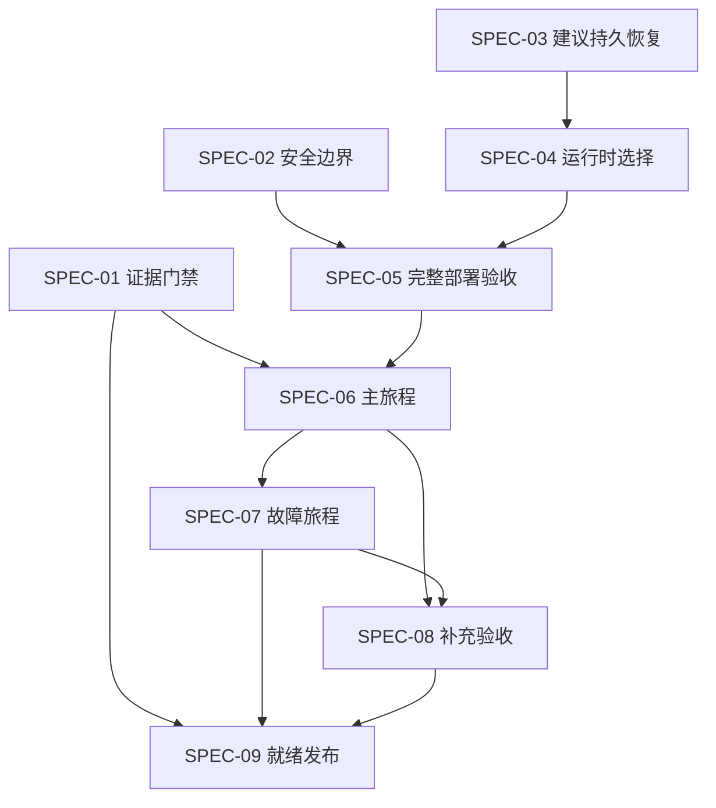

# 设计与测试边界

## Context

本设计综合已确认的审查修复方案及 ADR-0023。此次只交付规格和任务；不执行生产修复、秘密轮换、角色验收或状态提升。已有用户修改保留。

## Goals / Non-Goals

目标是可靠运行、真实角色验收与可核查 READY；沿用既有框架及领域模型。不扩展业务功能、真实渠道、模型平台或第二套数据后端。

## Decisions

1. **测试边界沿用已确认的正式入口**：业务以 API/UI 为最高边界，证据以 CLI 检查/封包为边界，部署以启动/恢复命令为边界。IncidentCommand 是既有深边界，不为每个 Agent 添加平行测试入口。
2. **实施粒度是九个能力**：证据、安全、持久建议、模式选择、构建、主旅程、故障旅程、补充验收、就绪发布。测试合同提前定义，真实执行依赖环境与修复完成。
3. **证据与注册表分离**：部分检查 → 完整证据封包 → 覆盖矩阵 → 注册表候选 → 当前运行比对 → 原子应用。正式注册表 READY 不是封包前提。
4. **交付标签与业务状态分离**：ready-for-agent 表示规格清晰可交接；任务依赖未完成时不能执行最终验收。功能 READY 仅由本次真实证据产生。
5. **执行采用至少一次，业务效果幂等**：投递、执行租约、终态副作用与 ACK 共同解决恢复问题。模型超时的不确定成本如实记录，不声称供应商恰好调用一次。
6. **保持既有主数据基线要求**：新 run 使用隔离环境/场地准备主数据，已有业务与失败包保留。固定验收场地与已有样本冲突时使用独立 UAT 部署，不清空原部署。
7. **自动化执行角色，不改权限**：独立账号、会话和正式渠道身份映射，业务数据只通过正式接口推进。测试夹具和故障注入标识明确。
8. **范围为当前已确认功能**：主旅程优先实施，注册表其他要求仍须真实覆盖；四入口自动证据与视觉签收分别报告。

## Dependency Graph

该图表示最终集成/验收前提，不禁止提前编写下游契约、执行器或固定夹具。SPEC-01 优先，SPEC-02/03 与 SPEC-05 的工具链部分可并行；正式 Live 验收前必须完成实际安全和运行修复。

## Risks / Trade-offs

- 现有 seal 对部分步骤过于宽松：保留部分检查，仅对 seal 强制全量，避免破坏日常诊断。
- 不同 Agent 分布多个 trace：以业务来源链聚合，不能把全链误限定为单 trace。
- Redis 与数据库跨提交窗口：持久待派发与幂等恢复要覆盖每个中断点，不能只替换队列类型。
- Hatchet 运行时配置残留：使用显式模式，并核验 worker；避免路径存在即启用或静默回退。
- 模型响应非确定性：行为测试用固定边界，真实模型单独验收，不能让 mock 证据流入 READY。
- 当前机器曾有 Docker 不可用及 Python 依赖缺失：实施时重新探测，规格不把历史环境快照当成永久结论。
- 四入口自动验收通过不等于视觉签收或退场许可；报告独立门禁避免假完成。

## Migration / Rollback

- 先补证据合同及拒绝反例，再更改运行时；合同版本变化应显式处理旧包，保留原始证据。
- 队列/执行模式切换保留在途归属；不能抛弃旧 pending。运行时变更回滚前也须核对在途工作。
- 秘密轮换协调真实使用方，禁止用数据库重置回滚；轮换失败按可验证恢复程序处理。
- 注册表候选未通过时不修改正式状态；应用失败恢复前一完整版本。
- 四入口切流及回滚遵守 ADR-0022，未经视觉签收不提升相关门禁。

## Open Questions

没有阻止规格编写的产品决策。实际代理网络、Secret 可用性、工作流租约参数和环境容量在实施时据事实确定并记录；不能把尚未验证的值写成已通过条件。
